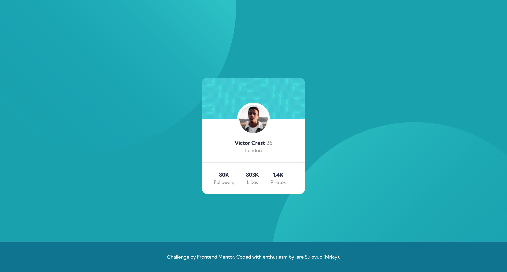

# Frontend Mentor - Profile card component solution

This is a solution to the [Profile card component challenge on Frontend Mentor](https://www.frontendmentor.io/challenges/profile-card-component-cfArpWshJ). 

## Table of contents

- [Overview](#overview)
  - [The challenge](#the-challenge)
  - [Screenshot](#screenshot)
- [My process](#my-process)
  - [Built with](#built-with)
  - [Continued development](#continued-development)
- [Author](#author)

## Overview

### The challenge

Users should be able to:

- View the optimal layout for the component depending on their device's screen size

### Screenshot



### Links

- Solution URL: [Github](https://github.com/jeresulovuo/profile-card)
- Live Site URL: [Vercel](https://mrjays-profile-card.vercel.app//)

## My process
Starting with mobile first approach, I analyse both the designs in mobile and desktop view. By doing, I can understand the structure better and design a layout that suits adjusts according in both mobile and desktop.

- There are two sections.
    - Body (container for top circle and bottom circle)
    - Card
      - Top pattern
      - Profile picture 
        - Negative MarginTop, padding, bg-white,  
      - Profile Info
      - Stats
        - A container -> flex, flex-rows, gap
    - Footer

### Built with

- Semantic HTML5 markup
- [TailwindCSS](https://tailwindcss.com/)
- Flexbox
- Mobile-first workflow

### What I learned

This project was used so I can better learn to add custom css variables to html via cdn. By doing, I learned how to better code custom variables such as:

```
  <link rel="stylesheet" href="https://fonts.googleapis.com/css?family=Kumbh+Sans:400,700" />
  <script src="https://cdn.tailwindcss.com"></script>
  <script>
    tailwind.config = {
        theme: {
            extend: {
                fontFamily: {
                    Kumbh: ['Kumbh Sans', 'sans-serif']
                },
                colors: {
                    'Dark-cyan': 'hsl(185, 75%, 39%)',
                    'Very-dark-desaturated-blue': 'hsl(229, 23%, 23%)',
                    'Dark-grayish-blue': 'hsl(227, 10%, 46%)',
                    'Dark-gray': 'hsl(0, 0%, 59%)'
                }
            }
        }
    }
    </script>
```

### Continued development

This component can be further developed with different structure. And reused for another project.

## Author

- Website - [Jere Sulovuo/ MrJay's Simple Portfolio](https://mrjays-simple-portfolio.vercel.app/)
- Github - [Jere Sulovuo (MrJay)](https://github.com/jeresulovuo)
- Frontend Mentor - [@jirimicvl](https://www.frontendmentor.io/profile/jirimicvl)